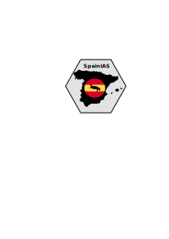

## Overview

SpainIAS is an R package that helps users plot the occurrences of different species in Spain. Below are the key components and functionalities of the package:

- `sp_data()` This function accepts a list of species names and downloads their occurrence data. The data is filtered to include occurrences in Spain (country = "ES"), and it is further filtered to only include records that have coordinates. It returns a data frame with the columns scientificName, decimalLatitude, decimalLongitude, year, countryCode, and coordinateUncertaintyInMeters.
- `plot_occurrences()` This function takes in the data fetched by sp_data and plots it on a map of Spain. It has the following optional arguments:
  
  -  by.year: If TRUE, the points in the plot will be color-coded based on the year of occurrence. The gradient is specified with a custom color palette.
  
  - all_species: If TRUE, occurrences of all species are plotted together; otherwise, a separate plot is generated for each species.
  
  - plot_type: Two options are available— "points" or "distribution". The "points" option will plot individual occurrences, whereas the "distribution" will represent the density of occurrences in raster cells.

